# 🌸 Personal Tech Blog / Portfolio Website

A responsive and interactive personal portfolio blog website built using **HTML, CSS, and JavaScript**.  
This project showcases my academic journey, technical skills, creative projects, and personal interests in technology and multimedia.

---

## 🌐 Live Demo

👉 https://niindp.github.io/personal-tech-blog/  
📁 GitHub Repo: https://github.com/niindp/personal-tech-blog

---

## ✨ Overview

This website serves as my personal digital portfolio where I share:

- My academic background 🎓  
- Technical and multimedia projects 💼  
- Blog posts about my learning journey 📝  
- Contact information 📧  

It is designed with a modern pastel aesthetic (pink theme), smooth animations, and responsive layout for all devices.

---

## ✨ Features

- 🏠 **Home Page** – Personal introduction and highlights  
- 👩 **About Page** – Skills, background, and interests  
- 💼 **Projects Page** – Interactive project showcase with expandable cards  
- 📝 **Blog Page** – Personal learning journey and reflections  
- 📧 **Contact Page** – Contact form and social links  
- 🌙 **Dark Mode Toggle** – Saves user preference using localStorage  
- ✨ **Smooth Animations** – Scroll fade-in and hover effects  
- 🖼️ **Image Popup Viewer** – Click images to view full size  
- ❤️ **Custom Heart Cursor** – Unique interactive cursor effect  
- 📱 **Fully Responsive Design** – Works on mobile, tablet, and desktop  

---

## 🛠️ Technologies Used

- **HTML5** – Page structure  
- **CSS3** – Styling, layout, animations, responsive design  
- **JavaScript (Vanilla)** – Interactivity (dark mode, popup images, animations)  

---

## 🌸 Favicon Design

<p align="center">
  
</p>

> Minimal pastel pink heart favicon representing a friendly, creative, and approachable personal brand identity.

---

## 📸 Screenshots

> Below are previews of the Personal Tech Blog website across desktop and mobile views, along with key features.

---

## 💻 Desktop Views

### 🏠 Home Page
<p align="center">
  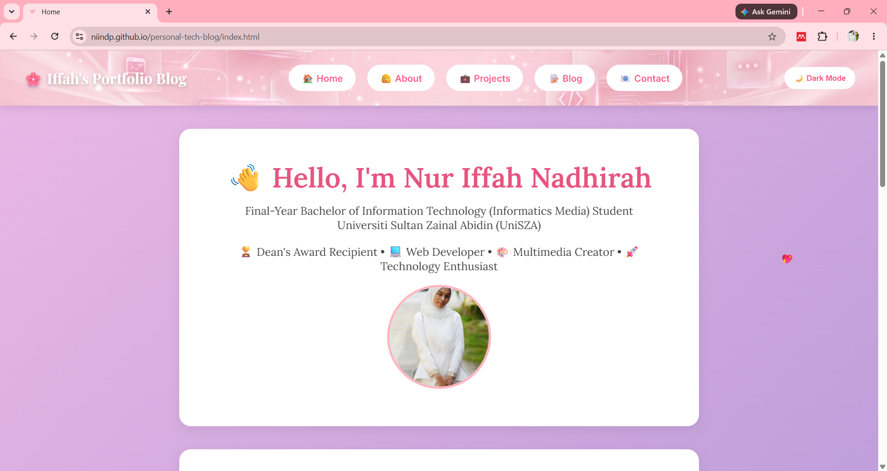
</p>

---

### 👩 About Page
<p align="center">
  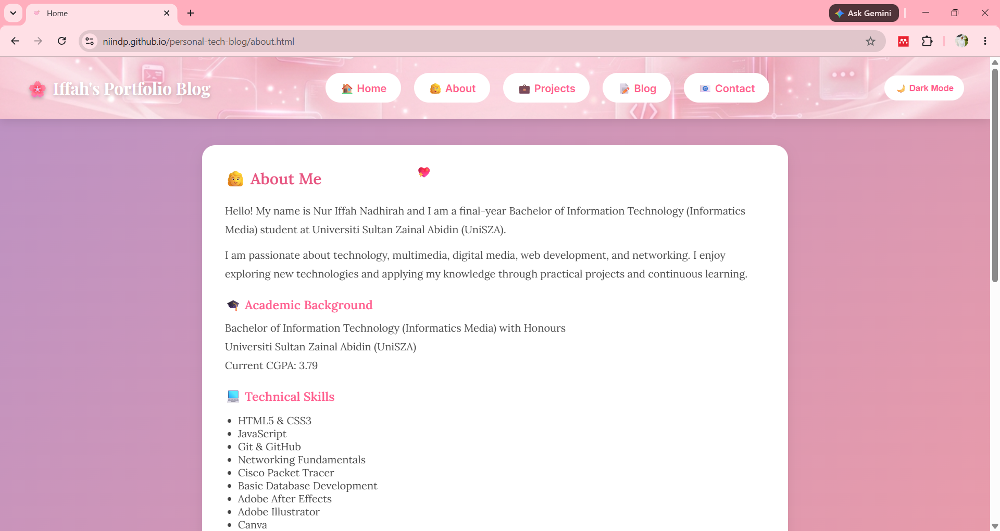
</p>

---

### 📝 Blog Page
<p align="center">
  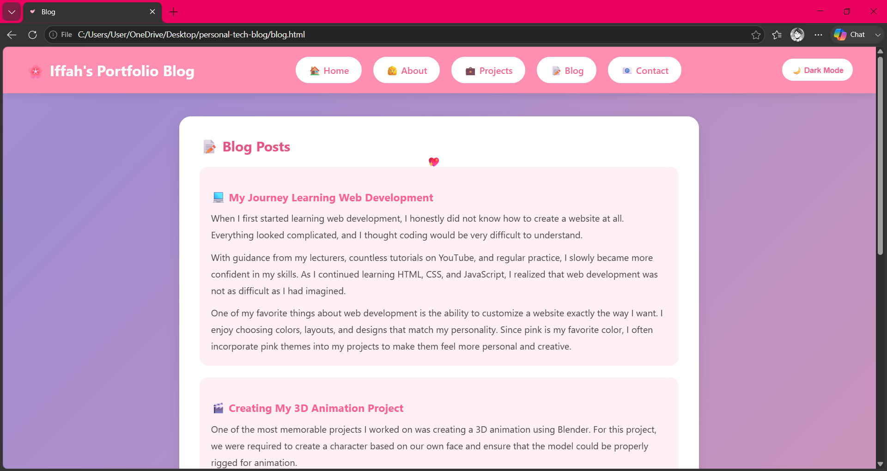
</p>

---

### 💼 Projects Page
<p align="center">
  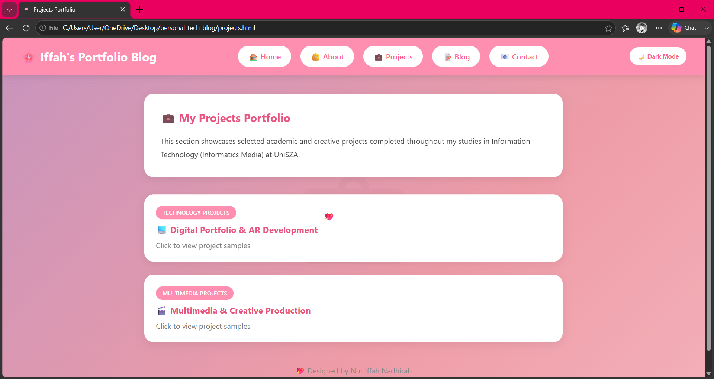
</p>

---

### 📧 Contact Page
<p align="center">
  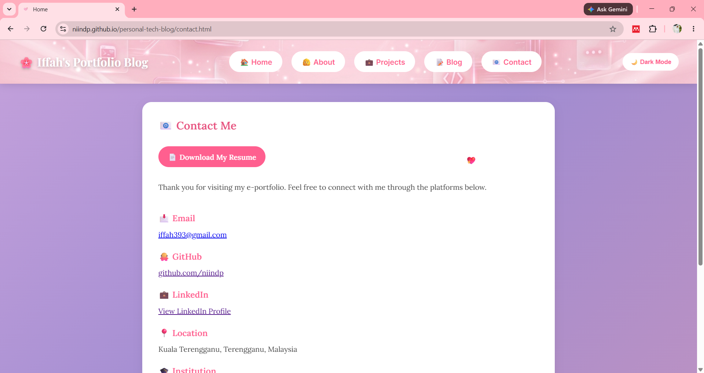
</p>

---

## 📱 Mobile Views

### 📱 Mobile Overview
<p align="center">
  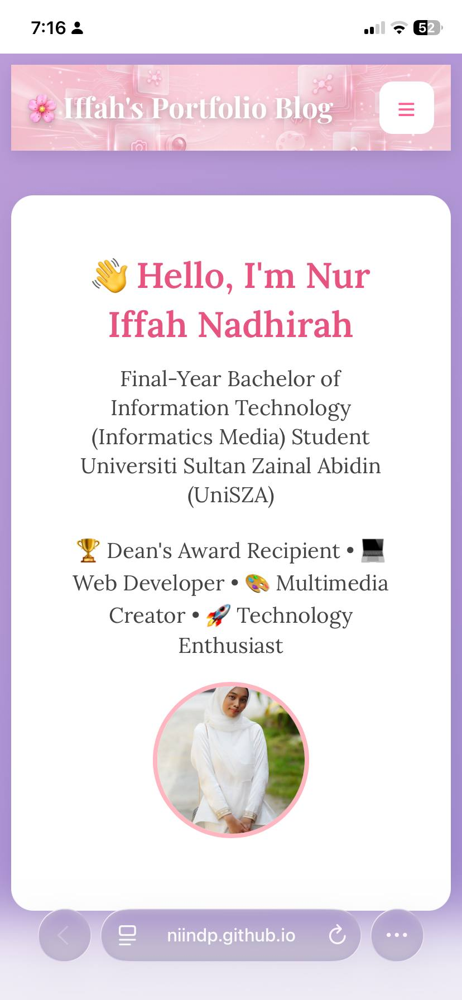
</p>

---

### ☰ Mobile Navbar
<p align="center">
  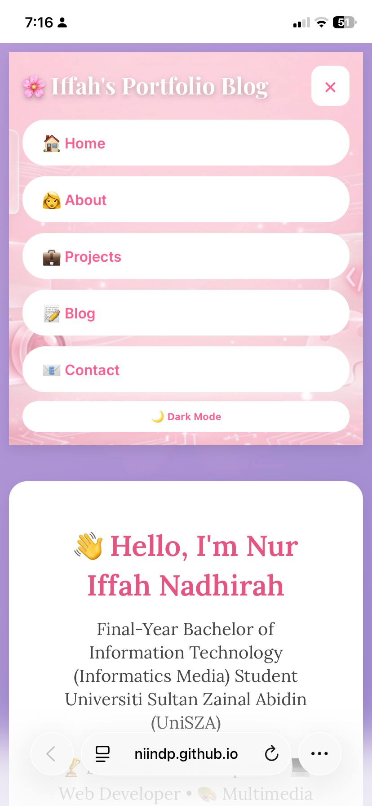
</p>

---

### 🌙📱 Dark Mode (Mobile)
<p align="center">
  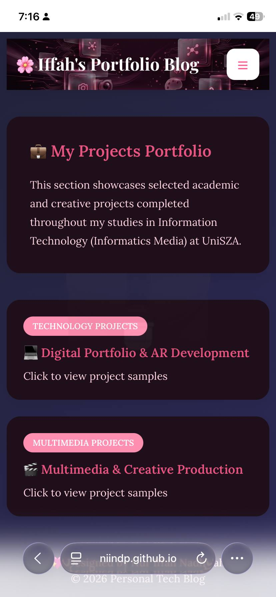
</p>

---

## ✨ Feature Highlights

### 🌙 Dark Mode Feature
<p align="center">
  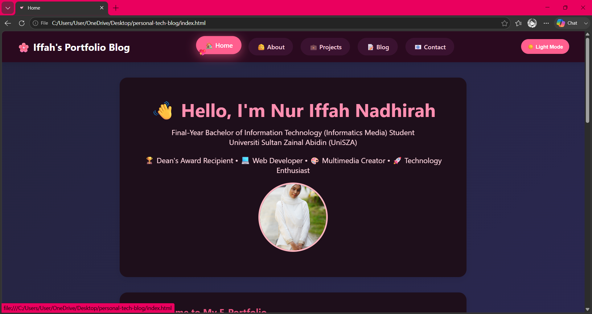
</p>

---

### 🖼️ Image Popup Feature
<p align="center">
  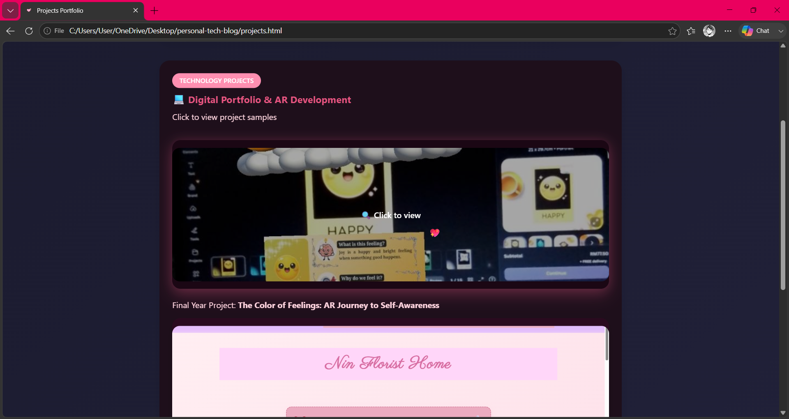
</p>

---

### ❤️ Custom Heart Cursor
<p align="center">
  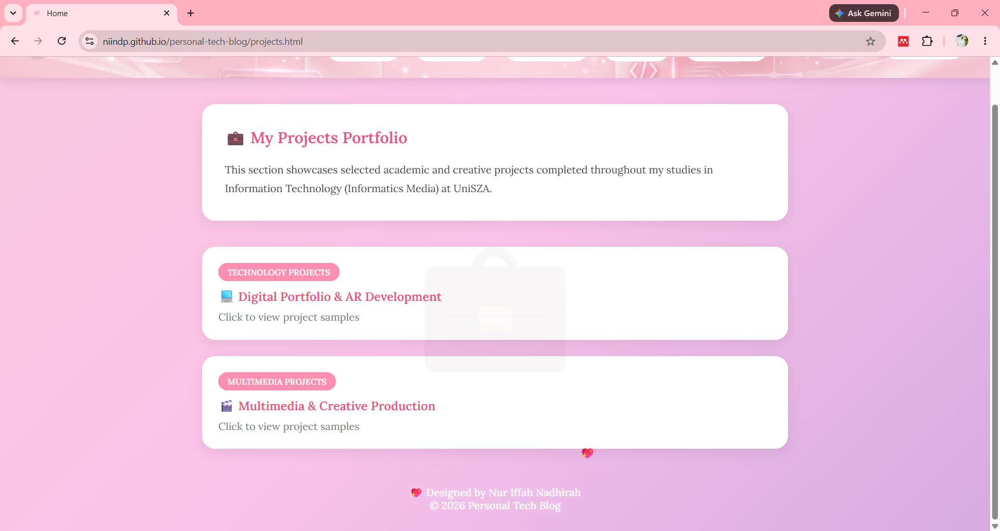
</p>

---

## 🚀 How to Run the Project

1. Download or clone this repository  
2. Open the project folder  
3. Double-click `index.html`  
   OR  
   Use **Live Server (VS Code)** for best experience  

---

## 📁 Project Structure

```text
personal-tech-blog/
│
├── index.html
├── about.html
├── blog.html
├── contact.html
├── projects.html
│
├── css/
│   └── style.css
│
├── js/
│   └── script.js
│
├── images/
│   ├── favicon.png
│   ├── profile.jpg
│   ├── tech-projects/
│   ├── multimedia-projects/
│   └── screenshots/
│        ├── home.png
│        ├── about.png
│        ├── blog.png
│        ├── contact.png
│        ├── dark.png
│        ├── mobile-home.png
│        ├── mobile-navbar.png
│        ├── mobile-dark.png
│        ├── projects.png
│        ├── popup.png
│
├── files/
│   └── resume.pdf
│
└── README.md